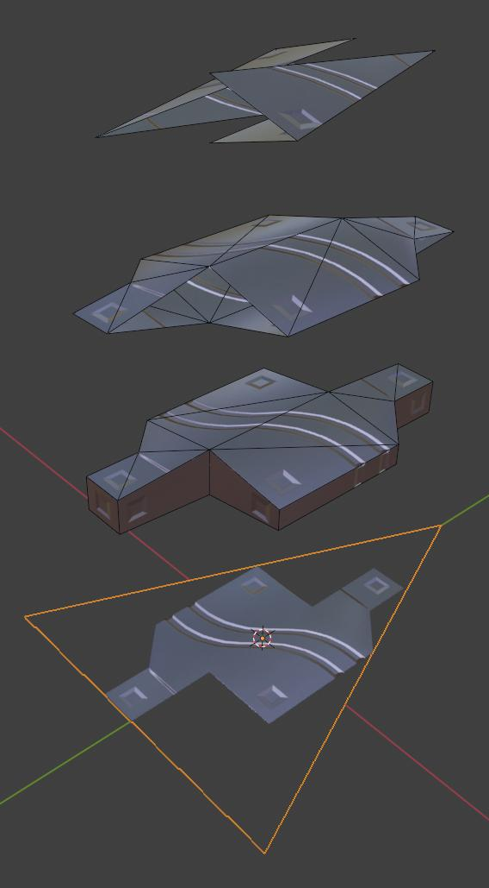

# Replicator avatar

Showcase video : https://www.youtube.com/watch?v=QGTpdXJ7kgY

Avatar links (public) :
- Full version, good rank : https://vrchat.com/home/avatar/avtr_25727835-517d-44b4-b743-b12a83241f21
- Excellent rank version, with pets and cut animation disabled : https://vrchat.com/home/avatar/avtr_a83e22eb-e7b4-44b2-bfb6-32516e53b55c

Avatar pedestals can be found on my experiment world : https://vrchat.com/home/world/wrld_8e55d0eb-5549-4744-b36a-afbafa18fcc3

This git folder contains source files for interesting parts of the avatar : shaders, scripts to generate shader input data, scripts to generate animators.
Blender project, mesh, textures and unity object tree are not included.

## Geometry compression using geometry pass

The avatar is a humanoid robot made of [replicator blocks](https://stargate.fandom.com/wiki/Replicator).
As all blocks are identical, I used a strategy where each block position, rotation, scale is encoded in a single triangle.
After mesh skinning, each triangle is transformed into a block by an instanced geometry pass in the shader.

The geometry of the block is stored as an array of vertex data constants in the shader : `baked_geometry_data.hlsl`.
This data is generated by the `generate_shader_code.py` blender python script, from a mesh setup illustrated in the picture below.
The reference triangle is superposed with the 3 LOD (*level of detail*) meshes, which have respectively 44 / 20 / 4 triangles per block.
The script converts the vertex data of blocks to the triangle reference frame, splits it into 10 triangle streams for the geometry pass (10 instances), and generate the data tables with offsets for each instance.

This vertex data is then used by the shader pass.
`prototype.shader` is a prototype of the strategy with normal colors as shading.

## Orels integration

The final shader uses the excellent [shader framework from Orels](https://shaders.orels.sh/) to combine the geometry pass with a PBR shading in a somewhat modular way :
- `template.orltemplate` : modified PBR template to add geometry pass hooks
- `replicator_pbr.orlsource` : Integration of the strategy as a base orels module. Expands geometry, supports dislocation and hiding blocks, and audiolink.

The `_MainTex` is not used for the normal shading, and only present to allow the fallback shader to be useful.
The main texture is an alpha-cutout render of the 3d block faces on the flat triangle, and the fallback shader is set to `cutout`.
This way each triangle will display the profile of the block in fallback mode, instead of nothing useful.
This is another reason to use triangles instead of point clouds.

The criterion to select between LODs is defined at [replicator_pbr.orlsource#L79](./replicator_pbr.orlsource#L79).
It uses pixel size inferred from the projection matrix, so it will adapt to headset resolution.
This can be tested locally by changing the render resolution in SteamVR.
This criterion has been recycled from my previous experiments about [pixel-perfect PN tessellation](../shaders/geometry_augmentation).

## Dislocation

The replicator block shader also implement dislocation animations on the blocks.
Each block will rotate and fall in worldspace (`d(t) = v_init t + (0, 0, -0.5g) t^2`).
The initial speed and rotation vectors are choosen from a constant table of random values (`baked_random_values.hlsl`).
The geometry pass strategy helps here, as we can use the geometry pass primitive-id to index the table.

Dislocations animations are driven from parameters in `avatar.orlshader`.
- Dislocation uses additionnal UVs to encode topological information about the avatar. They are computed by [NDMF](https://github.com/bdunderscore/ndmf) script `ReplicatorConfigureAvatar.cs`.
- The animator is entirely defined with [Animator as code (V0)](https://github.com/hai-vr/av3-animator-as-code) script `ReplicatorAvatarAnimator.cs`.
- Global dislocation uses a delay from top to bottom to be progressive. Triggered by a contact on the core of the avatar, or menu item.
- Arm dislocation uses a distance contact at the elbow to detect the cut point, with a capsule on each side to determine the side.
  It uses a `[-1, 1]` coordinate along each arm / leg stored in UVs.

Both animations can be triggered by other avatars with the right `VRCContactSender` tags : `Damage` or `Blade`.

## Pets

The avatar has pets in the shape of the iconic insectoid replicator from the series.

One pet is a follower which is part of the main skinned mesh.
It uses normal bone animations with reparenting to follow the legs during deployement / retraction.
The follower logic is a simple physbone.

An second pet system can spawn up to 4 pets that go in a straight line in worldspace.
These are basic `MeshRenderer`, and the skinning and animation is done in the shader.
The strategy is viable only for very simple bone configurations : 4x1d rotation sequence at most, and vertices with only 1 bone influence each.
- `pet.orlshader` : applies the emulated skinning pass in the vertex shader
- `pet_data.orlsource` : animation frame data (sampled from a real unity animation), and bone configuration for each vertex (bone id stored in UVs)
- `ReplicatorConfigurePet.cs` : creates the tables and sets custom UVs, from a skinned mesh and animations on it. Also mirrors animations so they only need to be set for one side of the pet.

## Animations

Avatar animator is entirely defined with [Animator as code (V0)](https://github.com/hai-vr/av3-animator-as-code), in `ReplicatorAvatarAnimator.cs`.
It uses direct blend tree when useful to remove simple animator layers.

Many animations *reorganize* blocks, implemented using blendshapes in combination with bone reparenting : right hand transformations, shield, follower pet.
When inactive, the blocks used by the animations are packed into tiled patterns.
Doing this manually is annoying so a blender script (`setup_packing_blendshape.py`) is used to generate the blendshapes of selected block triangles into tiled patterns.
The block mapping is random to not look too mechanical. 
The blocks are symmetrical, so 2 orientations of the triangle will give the same result, and the script chooses the one that has the smallest rotation during the blendshape to prevent distortions.

## Snowflake alternative material

A material swap that replaces blocks by raymarched snowflakes : [Snowflake.shader](./snowflake/Snowflake.shader).
The raymarch strategy has been adapted from https://www.shadertoy.com/view/Xsd3zf.
A geometry pass is used to generate either boxes at close range, or a simple quad at long range, as support for the raymarch.

The snowflake lighting model is improvised by adding transmission after having read some articles about PBR models, and looking at the lighting code from orels PBR shaders.
It looks ok but is very dependent on a good map lighting setup.

## Visor overlays

A rectangle visor can be deployed by grabbing it from its torso rest position with the left hand.
Various overlay shaders can be applied to the quad surface inside ; they are selected by sliding the right index on the bottom edge of the visor.
The set of overlay shader contains typical world exploration tools like displaying normals, wireframe, transform + rangefinder HUD, audiolink debug, ...

The shaders are stored in their [own repository](https://github.com/lereldarion/unity-shaders) with VCC packaging.
This is convenient because I use them accross multiple avatar unity projects.
